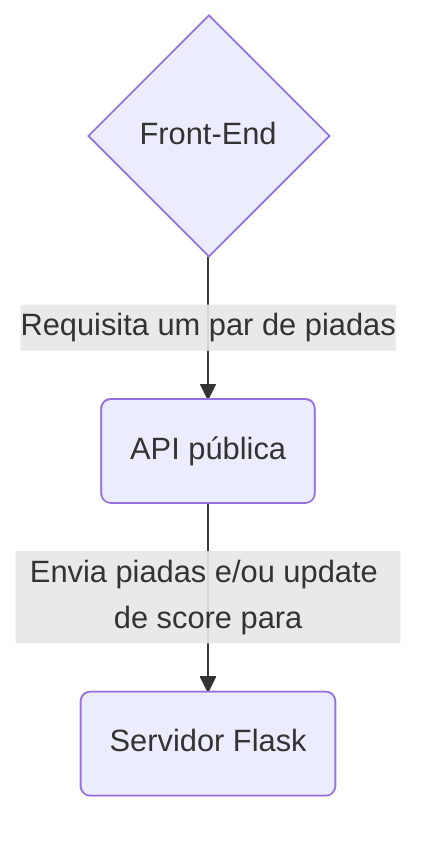

# ULTIMATE DAD JOKE CHAMPIONSHIP

## O que é?
Esse é o front end de um projeto conclusão de curso da pós-graduação em desenvolvimento de software da PUC-Rio.
O web app é uma `batalha de "Dad Jokes"`, dois combatentes contam uma piada e você escolhe qual a melhor.
Cada **voto soma uma ponto** tanto para a piada quanto para o combatente que a contou.

## Objetivo do Projeto 
Estudo sobre `micro serviços e docker`. Construi dois componentes com responsabilidades restritas e auto contidos, seguindo os princípios de micro serviços.

## Como funciona?
O web app é composto de 3 componentes independentes. Estes são:
- Componente A:  Front End em React que consome duas APIs, uma pública com um estoque de piadas e outra privada com o backend.
- Componente B: API pública com com centenas de piadas: https://api-ninjas.com/api/dadjokes
- Componente C: Servidor feito com as tecnologias FLASK / SQLite / SQLalchemy , detalhes aqui: https://github.com/ribeiroAllison/MVP3-PUC-BACK

## Relação entre componentes:

## Tecnologias utilizadas:

### React.js com o Framework Next.js:

>*Principais conceitos:*

1. Async Functions.
2. API requests.
3. Promise.
